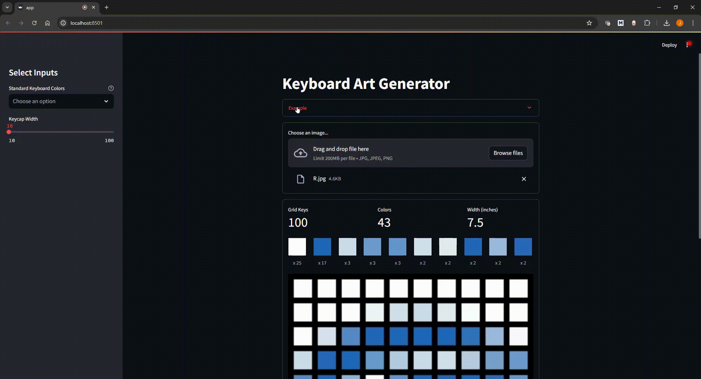

# Keyboard Art Generator
[](http://hits.dwyl.com/justinj-evans/keyboard-art-generator)


Keyboard Art Generator is a simple and interactive tool that enables you to design and generate art using the keycaps of a keyboard. It transforms your creative concepts into a visual representation made entirely of keyboard keys.

## Demo
<p align="center">
    <a href="https://"></a>
</p>

## Running the app locally
```bash
git clone https://github.com/justinj-evans/keyboard-art-generator.git
pip install -r requirements.txt
streamlit run app.py
```

## Contributors
Contributions of any kind welcome.

## License
This project is licensed under the MIT License - see the [LICENSE](https://github.com/justinj-evans/typepixels/blob/0c88a814231349d1c975e71f1dc4949f4398e3bc/LICENSE) file for details.